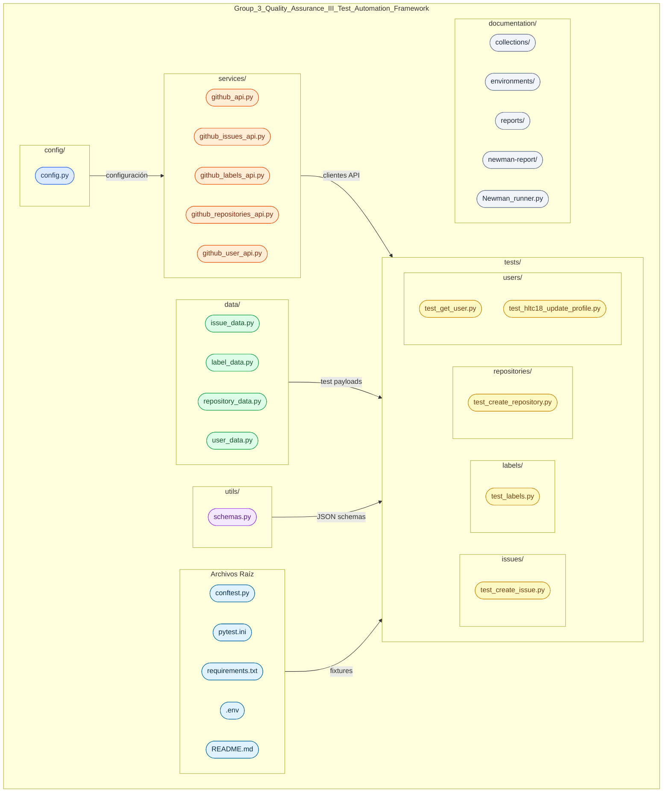

# Group 3 — Quality Assurance III: Test Automation Framework

Framework de automatización de pruebas de API usando Python y Pytest sobre la GitHub REST API.

## Tecnologías utilizadas

- Python 3.12+
- Pytest
- Requests
- JSONSchema
- python-dotenv
- GitHub REST API

---

## Instalación

### 1. Clonar el repositorio

```bash
git clone "https://github.com/GutBla/Group_3_Quality_Assurance_III_Test_Automation_Framework.git"

cd Group_3_Quality_Assurance_III_Test_Automation_Framework
```

### 2. Crear entorno virtual

```bash
python -m venv .venv
```

**Activar en Windows:**
```bash
.venv\Scripts\activate
```

**Activar en macOS/Linux:**
```bash
source .venv/bin/activate
```

### 3. Instalar dependencias

```bash
python -m pip install -r requirements.txt
```

---

## Configuración del proyecto

Crear un archivo `.env` en la raíz del proyecto con las siguientes variables:

```env
BASE_URL=https://api.github.com
GITHUB_USERNAME=tu_usuario_github
GITHUB_REPO=tu_repositorio
GITHUB_TOKEN=tu_github_token
```

---

## Estructura del proyecto



---

## Cómo ejecutar las pruebas

> Siempre usar `python -m pytest` para asegurar que se usa el entorno virtual activo.

**Ejecutar todos los tests:**
```bash
python -m pytest -v
```

**Ejecutar un archivo específico:**
```bash
python -m pytest tests/issues/test_create_issue.py -v
python -m pytest tests/users/test_hltc18_update_profile.py -v
```

**Ejecutar por rama de feature:**
```bash
git checkout feature/HLTC-18-actualizar-perfil-github-api
python -m pytest tests/users/test_hltc18_update_profile.py -v
```

---

## Ramas del proyecto

| Rama | Descripción |
|------|-------------|
| `main` | Rama principal estable |
| `feature/HLTC-18-actualizar-perfil-github-api` | Prueba automatizada HLTC-18: actualizar perfil de usuario |

---

## Convención de commits

```
feat: descripción del feature agregado
fix: descripción del bug corregido
test: nueva prueba automatizada
docs: actualización de documentación
```